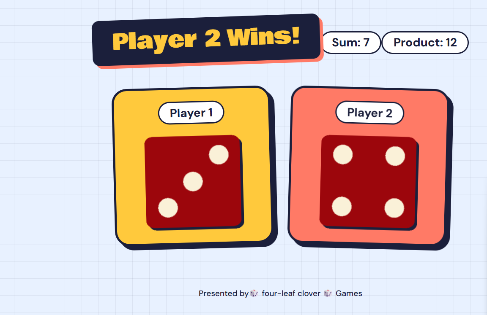

# Dicee

A two-player dice game for the browser. Refresh the page and both players roll at random. The headline announces the winner, so it settles small arguments quickly.



## Features

- Random dice roll (1 to 6) for Player 1 and Player 2 on every page load
- Dice images update to match each roll
- The heading announces the winner, or a draw
- Responsive layout with a tumbling-dice animation on load

## How It Works

1. `Math.random()` and `Math.floor()` generate a number from 1 to 6 for each player.
2. The DOM is used to select each dice image and change its `src` to the matching dice picture.
3. The two numbers are compared, and the `h1` text is updated with the result.

## Project Structure

```
Dicee/
├── index.html
├── style.css
├── index.js
└── images/
    ├── dice1.png
    └── ... dice6.png
```

## How to Run

Open `index.html` in any browser, then refresh the page to roll again.

## Tech Used

HTML5, CSS3, JavaScript (ES6), DOM manipulation

## What I Learned

Selecting and changing page elements with the DOM, generating random numbers, and writing comparison logic for a small interactive project.
